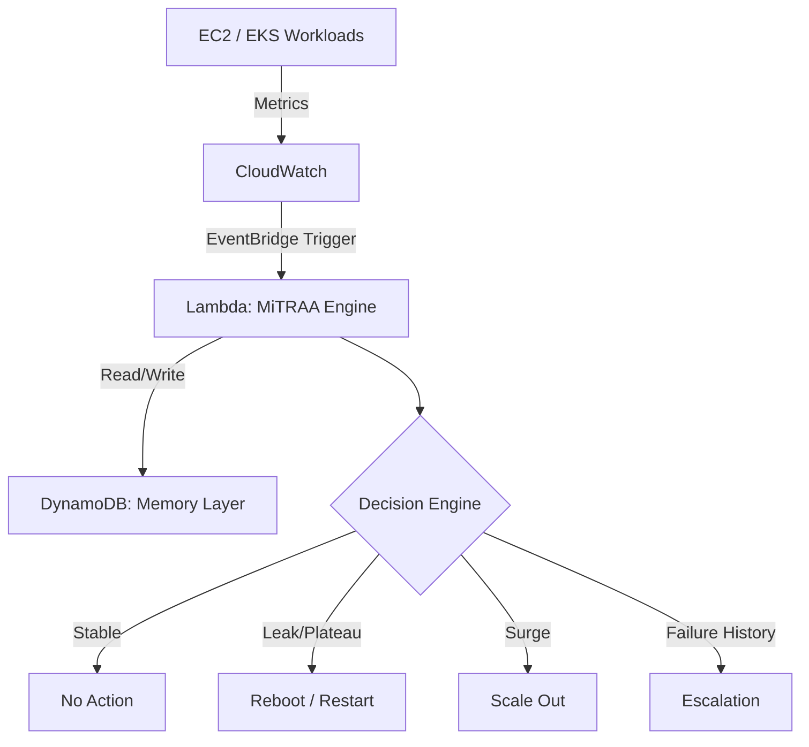

# MiTRAA: AIops based cloud infrastructure (AIOps MVP)

## 1. Overview

MiTRAA AIops is a AWS-native AIOps framework designed to automate infrastructure monitoring and remediation.

Unlike traditional monitoring systems that rely on static thresholds, MiTRAA performs **multi-metric pattern analysis** to:

* Identify the nature of system degradation
* Select the most cost-effective remediation
* Learn from past outcomes to improve future decisions

The system evolves from reactive alerting to **autonomous decision-making with memory**.

---

## 2. Problem Statement

Traditional cloud monitoring systems (e.g., threshold-based alarms) suffer from:

* Alert fatigue due to noisy signals
* Lack of context (cannot differentiate root causes)
* Repetitive manual interventions
* Inefficient scaling decisions (cost overhead)

MiTRAA addresses these issues by introducing:

* Pattern-based anomaly detection
* Context-aware remediation
* Stateful decision-making

---

## 3. Key Capabilities

### 3.1 Pattern-Based Detection

MiTRAA evaluates recent metric trends (CPU + Network) instead of single-point thresholds.

### 3.2 Autonomous Remediation

Depending on the detected pattern:

* Restart instances or workloads (cost-efficient)
* Scale infrastructure (capacity-driven)

### 3.3 Memory Layer (State Awareness)

* Stores remediation history in DynamoDB
* Avoids repeating failed actions
* Enables escalation logic

### 3.4 Cost Optimization

* Prefers reboot over scaling when applicable
* Reduces unnecessary infrastructure expansion

---

## 4. Comparison with Traditional Solutions

| Feature           | CloudWatch / ASG | MiTRAA         |
| ----------------- | ---------------- | -------------- |
| Decision Logic    | Threshold-based  | Pattern-based  |
| Context Awareness | None             | Multi-metric   |
| Remediation       | Scale only       | Reboot + Scale |
| Memory            | Stateless        | Stateful       |
| Cost Efficiency   | Reactive         | Optimized      |

---

## 5. Technology Stack

* Cloud Provider: AWS
* Compute: EC2, Auto Scaling Groups
* Serverless: AWS Lambda (Python, Boto3)
* Monitoring: Amazon CloudWatch (metric math)
* Orchestration: Amazon EventBridge (1-minute triggers)
* State Store: Amazon DynamoDB
* Container Layer (Phase 3): Amazon EKS (Kubernetes)

---

## 6. Architecture

---

## 7. Implementation Phases

### Phase 1: Anomaly Detection Engine (Completed)

The system classifies anomalies using recent time-series data:

#### 1. Blip (Noise)

* Short spike followed by immediate drop
* Action: Ignore

#### 2. Plateau (Sustained High Load)

* CPU consistently high across multiple intervals
* Action: Restart

#### 3. Silent Leak (Gradual Rise)

* CPU increases gradually with low network usage
* Action: Restart

#### 4. Viral Surge (Traffic Spike)

* CPU and network increase together
* Action: Scale out

---

### Phase 2: Memory Layer (Completed)

Enhancements:

* DynamoDB used for audit logging
* Tracks actions at **ASG level instead of instance level**
* Introduced **failure-aware logic**:

If reboot fails:

* Skip future reboot attempts
* Escalate directly to scaling

Additional controls:

* Warm-up gate (avoid actions during instance startup)
* Outcome validation (success vs failure)

---

### Phase 3: Kubernetes Integration (In Progress)

Extension from VM-based remediation to container orchestration:

* EKS integration via kubectl through jump server
* Pod-level remediation (restart deployments)
* Application-level scaling using Kubernetes
* Future: node-level scaling via cluster autoscaler

---

## 8. Remediation Logic

The system follows a hierarchical decision flow:

1. Detect anomaly pattern
2. Query historical actions from DynamoDB
3. Evaluate:

   * Has reboot failed recently?
4. Execute:

* If no failure → attempt reboot
* If failure → escalate to scale-out

This ensures:

* Minimal cost
* Controlled escalation
* Reduced repetitive failures

---

## 9. Execution Flow

1. CloudWatch collects metrics
2. EventBridge triggers Lambda every minute
3. Lambda:

   * Fetches recent metrics
   * Queries DynamoDB
   * Classifies anomaly
   * Executes action via AWS SDK / SSM
4. Action result is logged
5. Future decisions use stored history

---

## 10. Current Status

* EC2 + ASG remediation: Completed
* Pattern detection engine: Validated
* Memory layer: Implemented
* EKS integration: Functional (restart + scale tested)

---

## 11. Future Enhancements

* Pod-level culprit detection (identify noisy pod)
* Automated pod eviction instead of full restart
* Integration with Cluster Autoscaler
* ML-based anomaly classification
* Multi-metric expansion (memory, disk I/O)

---

## 12. Conclusion

MiTRAA demonstrates a shift from traditional monitoring to intelligent, self-healing infrastructure.

By combining:

* Pattern-based analysis
* Stateful memory
* Automated remediation

the system reduces operational overhead and optimizes cloud resource usage, aligning with modern SRE practices.

---

So No more OOPS , only AIOps
